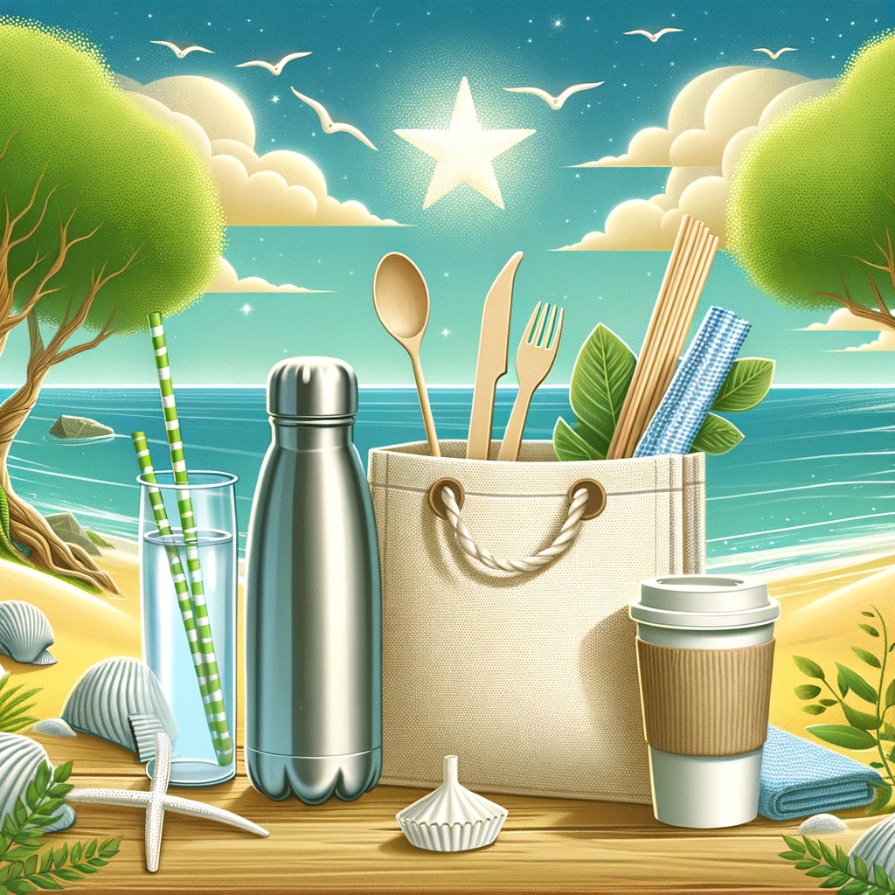

# 1. Riduci il consumo di plastica monouso 🛍️

La plastica monouso è una delle principali cause di inquinamento globale. Ogni anno, milioni di tonnellate di plastica finiscono negli oceani, minacciando la vita marina e danneggiando gli ecosistemi. 🌊 Questo inquinamento non solo distrugge gli habitat marini, ma contribuisce anche alla formazione di microplastiche che entrano nella catena alimentare. Ridurre il consumo di plastica monouso è un passo essenziale per diminuire il nostro impatto ambientale e preservare il nostro pianeta per le generazioni future.

Ogni piccola scelta quotidiana può fare una grande differenza. Cambiare le proprie abitudini può sembrare difficile all'inizio, ma con il tempo diventa naturale. Ecco alcune azioni semplici che puoi adottare:

### Ecco alcuni suggerimenti pratici:

- **Porta sempre con te una borraccia riutilizzabile**: La plastica delle bottiglie d'acqua è una delle principali fonti di inquinamento. Portare una borraccia riutilizzabile ti permette di evitare di acquistare bottiglie in plastica ogni volta che hai sete. In questo modo riduci il consumo di plastica e risparmi denaro a lungo termine.
  
- **Usa sacchetti riutilizzabili per la spesa**: I sacchetti di plastica sono leggeri e facili da usare, ma una volta che vengono scartati, impiegano centinaia di anni per degradarsi. Porta con te dei sacchetti riutilizzabili quando fai la spesa. Puoi anche usare borse in cotone o altri materiali ecologici per ridurre ulteriormente l'impatto ambientale.

- **Scegli prodotti confezionati in materiali biodegradabili o acquistati sfusi**: Evita confezioni e imballaggi in plastica quando possibile. Preferisci frutta e verdura sfuse o acquisto di prodotti confezionati in materiali biodegradabili, come carta o cartone. Molti supermercati ora offrono alternative ecologiche che aiutano a ridurre il consumo di plastica.

- **Adotta l'uso di posate, piatti e bicchieri riutilizzabili**: In occasione di picnic, feste o pranzi fuori, porta con te posate, piatti e bicchieri riutilizzabili. Oltre a ridurre l'impatto ambientale, queste alternative sono spesso più eleganti e comode rispetto a quelle usa e getta. Puoi scegliere set in acciaio, bambù o materiali compostabili.

- **Evita le cannucce in plastica**: Le cannucce sono piccole, ma rappresentano una parte significativa dei rifiuti di plastica che troviamo negli oceani. Opta per cannucce in materiali ecologici come bambù, acciaio, o carta, che sono facilmente smaltibili e non contribuiscono all'inquinamento.

Secondo Greenpeace, circa **8 milioni di tonnellate di plastica** vengono riversate negli oceani ogni anno, una quantità che potrebbe essere drasticamente ridotta con scelte più consapevoli e responsabili. Ogni anno, il volume di plastica che finisce negli oceani aumenta, ma possiamo invertire questa tendenza con decisioni più sostenibili nella nostra vita quotidiana.

**Ricorda**: Ogni piccolo gesto conta nel creare un futuro più pulito e sostenibile! Con il tuo impegno, puoi essere parte del cambiamento che il nostro pianeta ha tanto bisogno. 🌱

Inizia oggi stesso a ridurre il consumo di plastica monouso e coinvolgi chi ti sta vicino a fare lo stesso. Più siamo, maggiore sarà l'impatto positivo che riusciremo a creare!
