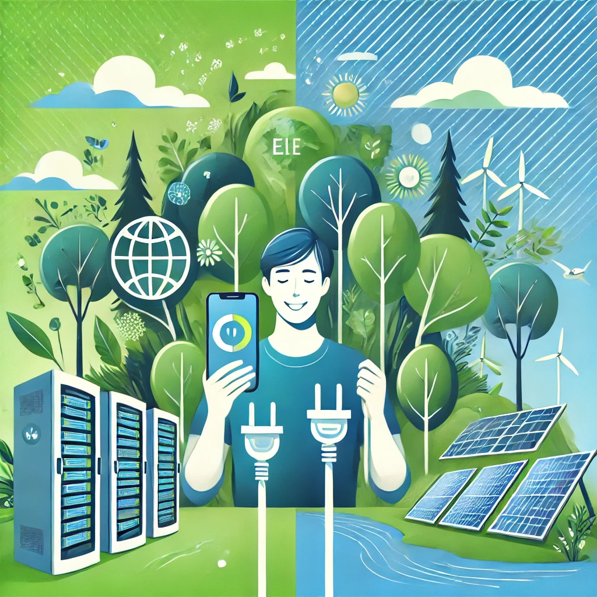

# 10. Riduci l'uso della tecnologia digitale 📱

L'uso della tecnologia digitale ha un impatto sull'ambiente che spesso sottovalutiamo. Ogni clic, ogni streaming, ogni e-mail inviata contribuisce al consumo di energia e all'emissione di gas serra, dato che i server e le infrastrutture necessarie per supportare il mondo digitale richiedono risorse significative. Ridurre il nostro uso quotidiano della tecnologia è un passo importante per ridurre il nostro impatto ecologico.

### Come ridurre l'uso della tecnologia digitale:

- **Riduci lo streaming e i contenuti ad alta intensità di dati**: Guardare video in alta definizione, ascoltare musica in streaming o giocare online consuma molta energia. Limita l'uso di streaming ad alta qualità e scarica contenuti quando possibile per ridurre la necessità di connessioni costanti.

- **Organizza e riduci le e-mail**: Ogni e-mail inviata o ricevuta richiede energia per essere archiviata e trasmessa attraverso i server. Evita di inviare e-mail inutili o di fare forwarding di messaggi che non sono necessari. Cerca di fare una pulizia regolare della tua casella di posta per eliminare messaggi vecchi e non rilevanti.

- **Disattiva dispositivi quando non in uso**: Molti dispositivi elettronici consumano energia anche quando non vengono utilizzati. Disattiva il Wi-Fi, il Bluetooth e spegni completamente i dispositivi quando non li usi. In particolare, evita di lasciare in standby computer, smartphone e altri dispositivi elettronici durante la notte.

- **Scegli dispositivi più efficienti**: Quando possibile, opta per dispositivi elettronici che consumano meno energia. Prodotti con etichette di efficienza energetica (come Energy Star) riducono l'impatto ambientale. Investire in dispositivi che durano più a lungo e che sono facili da riciclare è una scelta consapevole.

- **Semplifica e ottimizza le tue attività digitali**: Cerca di ottimizzare il modo in cui usi i dispositivi digitali, riducendo il tempo trascorso su schermi o sulle piattaforme social, così da evitare l'uso eccessivo di energia. Usa applicazioni che ti aiutano a monitorare il tuo consumo di energia e a prendere decisioni più consapevoli.

- **Scegli servizi di cloud sostenibili**: Quando usi servizi cloud o memorizzi dati online, scegli fornitori che adottano pratiche sostenibili, come l'uso di energie rinnovabili per i loro data center. Verifica le politiche ambientali delle aziende per supportare quelle più responsabili.

- **Mantieni e ricicla i dispositivi elettronici**: Estendi la vita dei tuoi dispositivi elettronici con manutenzione regolare e, quando non sono più utilizzabili, riciclali correttamente. Evita di gettarli nella spazzatura comune, poiché contengono materiali dannosi per l'ambiente.

- **Riconsidera le videoconferenze**: Anche se le videoconferenze sono un ottimo strumento per ridurre i viaggi, consumano comunque energia. Limita il numero di videoconferenze, usa chiamate audio quando possibile e disattiva il video se non strettamente necessario.

Ogni piccola azione che facciamo nel mondo digitale può avere un impatto positivo sul nostro pianeta. Ridurre il nostro uso della tecnologia digitale non solo aiuta a ridurre le emissioni di CO2, ma contribuisce anche a un uso più consapevole delle risorse. 🌍

[Leggi qui](https://www.greenspector.com/).
