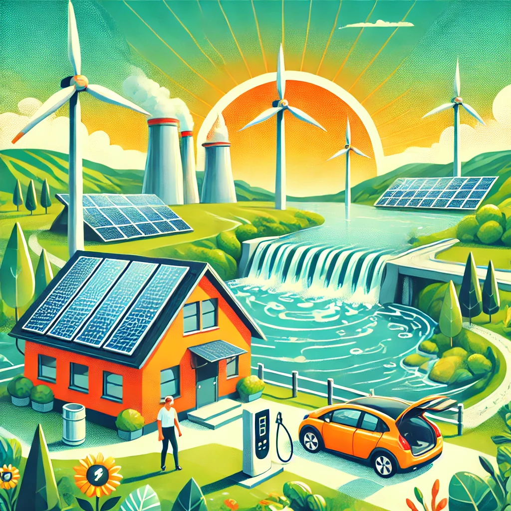

# Step 12: Supporta l'energia rinnovabile ☀️💨

L'energia rinnovabile è la chiave per un futuro sostenibile. Fonti come il sole, il vento e l'acqua forniscono energia pulita che non esaurisce le risorse del pianeta né contribuisce al cambiamento climatico. Sostenere e adottare l'energia rinnovabile è una delle azioni più importanti per ridurre l'impatto ambientale e promuovere un mondo più verde. 🌍

### Come puoi contribuire:

- **Passa a fornitori di energia verde**: Molti fornitori di energia offrono opzioni 100% rinnovabili, provenienti da fonti come il solare, l’eolico o l'idroelettrico. Cambiare fornitore è un gesto semplice che può avere un grande impatto.
  
- **Investi in pannelli solari**: Se hai una casa o un'azienda, valuta l’installazione di pannelli solari. Non solo ridurrai la tua impronta ecologica, ma potresti anche risparmiare sulla bolletta nel lungo periodo.

- **Sostieni progetti locali di energia rinnovabile**: Molte comunità stanno sviluppando progetti di energia condivisa, come parchi eolici e solari. Informati e partecipa a queste iniziative per accelerare la transizione energetica.

- **Riduci l'uso di combustibili fossili**: Evita il più possibile i prodotti e le attività che dipendono da petrolio, gas e carbone. Scegli alternative più sostenibili, come veicoli elettrici o trasporti pubblici alimentati da energie pulite.

- **Diffondi consapevolezza**: Condividi informazioni e risorse sull’importanza dell’energia rinnovabile con amici, familiari e colleghi. Più persone sono consapevoli, più rapidamente possiamo favorire un cambiamento globale.

### Perché è importante:

Secondo l'Agenzia Internazionale dell'Energia, le energie rinnovabili potrebbero rappresentare il 90% della nuova capacità energetica entro il 2050. Tuttavia, per raggiungere questo obiettivo, è essenziale accelerare il passaggio dalle fonti fossili a quelle rinnovabili. Sostenere queste tecnologie non solo riduce le emissioni di gas serra, ma crea anche posti di lavoro, migliora la qualità dell'aria e protegge gli ecosistemi naturali.

**Ricorda**: ogni scelta che fai, dai fornitori energetici ai mezzi di trasporto, ha un impatto diretto sul futuro del nostro pianeta. Sostenere l'energia rinnovabile significa investire in un futuro più pulito e sostenibile per tutti. 🌱

[Scopri altro](https://www.irena.org/).
