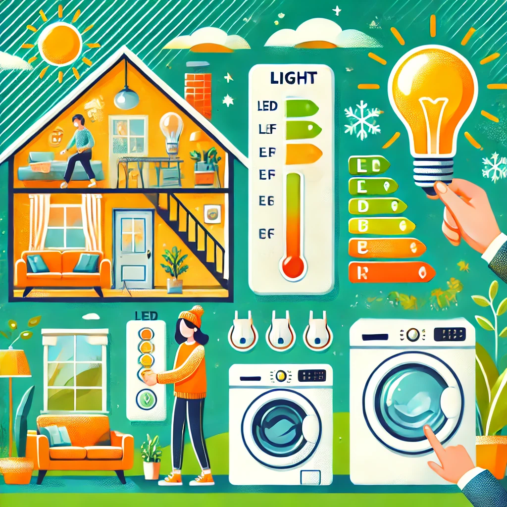

# 2. Risparmia energia 💡

Risparmiare energia è fondamentale per ridurre le emissioni di gas serra e contribuire alla lotta contro il cambiamento climatico. Ogni piccola azione, ripetuta quotidianamente, può fare una grande differenza. 💪

Ecco alcune strategie pratiche per risparmiare energia:

- **Spegni le luci** quando esci da una stanza. Può sembrare un gesto semplice, ma riduce il consumo di energia inutilizzata.
- Sostituisci le vecchie lampadine con quelle **LED a basso consumo**. Le lampadine LED consumano fino al 90% di energia in meno rispetto a quelle tradizionali.
- Utilizza **elettrodomestici efficienti** (di classe energetica A++ o superiore) per ridurre i consumi.
- Durante l'inverno, abbassa leggermente il termostato di casa e indossa vestiti caldi. In estate, preferisci i ventilatori agli impianti di climatizzazione.
- Scollega i dispositivi elettronici quando non sono in uso o utilizza una ciabatta multipresa con interruttore per spegnerli tutti contemporaneamente.

Secondo l’Agenzia Internazionale dell’Energia, l’efficienza energetica potrebbe ridurre le emissioni globali di CO2 fino al 40% entro il 2040. [Fonte 2]

Ricorda: risparmiare energia significa proteggere il pianeta e risparmiare denaro! 🌍
