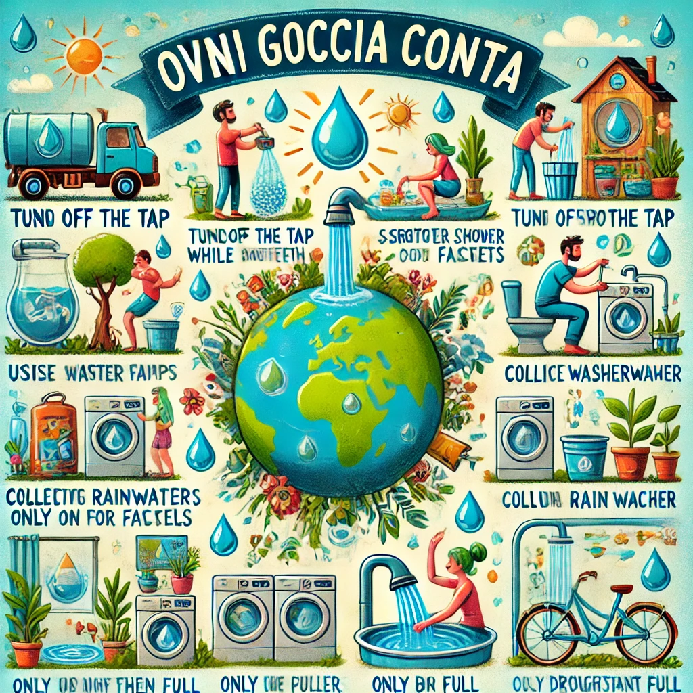

# 3. Riduci il consumo d'acqua 🚿

L'acqua è una risorsa essenziale per la vita, ma anche incredibilmente limitata. Sebbene il nostro pianeta sia ricoperto al 70% di acqua, meno dell'1% è effettivamente disponibile per il consumo umano. Con il cambiamento climatico, l'inquinamento e la crescente domanda, la riduzione del consumo d'acqua è diventata una priorità globale. Ogni goccia risparmiata contribuisce a preservare questa risorsa preziosa e a garantire la sua disponibilità per le generazioni future. 🌍

### Come risparmiare acqua nella vita quotidiana:

- **Chiudi il rubinetto mentre ti lavi i denti o le mani**: Questo semplice gesto può risparmiare fino a 6 litri d'acqua al minuto. Allo stesso modo, chiudi l'acqua quando insaponi i piatti o fai la barba.

- **Fai docce più brevi**: Ridurre di soli 2 minuti il tempo sotto la doccia può far risparmiare decine di litri d'acqua ogni giorno. Considera l’installazione di soffioni a basso flusso per ridurre ulteriormente il consumo.

- **Utilizza dispositivi per il risparmio idrico**: Installa riduttori di flusso per rubinetti e docce o cassette WC a doppio scarico, che utilizzano meno acqua per ogni utilizzo.

- **Ripara perdite d'acqua**: Una perdita da un rubinetto o una toilette può sprecare centinaia di litri d'acqua al mese. Controlla regolarmente tubature, rubinetti e impianti idraulici per evitare sprechi inutili.

- **Raccogli l’acqua piovana**: Se hai un giardino, installa un sistema per raccogliere l’acqua piovana. Può essere usata per annaffiare le piante o pulire le superfici esterne, riducendo la dipendenza dall’acqua potabile.

- **Annaffia il giardino nelle ore giuste**: Irrigare le piante al mattino presto o la sera, quando l’evaporazione è minima, è un modo efficace per ridurre il consumo d'acqua.

- **Usa gli elettrodomestici in modo efficiente**: Lava i vestiti e i piatti solo a pieno carico. Scegli lavatrici e lavastoviglie di classe energetica alta, che consumano meno acqua ed energia.

- **Sostituisci il prato con piante autoctone**: Se possibile, scegli piante native che richiedono meno irrigazione rispetto a specie esotiche. In alternativa, considera la xeriscaping, una tecnica che utilizza piante resistenti alla siccità.

- **Evita l'acqua in bottiglia**: Produzione e trasporto di acqua imbottigliata richiedono quantità enormi di risorse, inclusa l'acqua stessa. Usa una borraccia riutilizzabile e preferisci l'acqua del rubinetto, se potabile.

### Perché è importante?

Secondo le Nazioni Unite, circa 2,2 miliardi di persone nel mondo non hanno accesso a servizi idrici sicuri. Inoltre, si stima che entro il 2025 metà della popolazione mondiale potrebbe vivere in aree soggette a scarsità d'acqua. Ridurre il consumo d'acqua nelle nostre case e comunità può fare una grande differenza a livello globale. 🌱

### Ogni goccia conta 🌟

Ridurre il consumo d’acqua non solo preserva una risorsa vitale, ma aiuta anche a risparmiare energia utilizzata per il trattamento e la distribuzione dell'acqua. È un piccolo cambiamento che può avere un grande impatto. Fai la tua parte oggi: risparmia acqua, proteggi il pianeta e ispira gli altri a fare lo stesso! 🚰

[Scopri altro](https://www.worldwatercouncil.org/).
