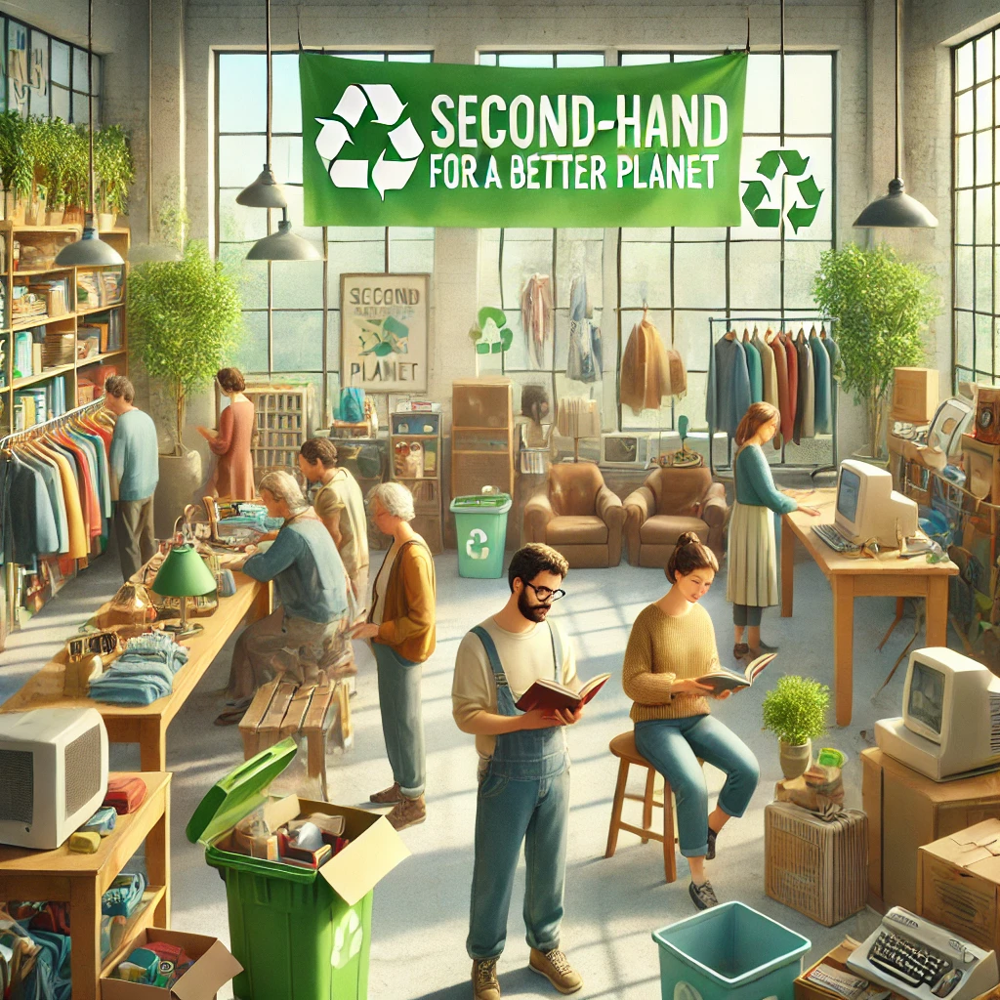

# 4. Acquista di seconda mano 🛍️♻️

Il mercato dell’usato è un’opportunità eccellente per ridurre l’impatto ambientale e promuovere un consumo più responsabile. Acquistare di seconda mano non solo aiuta a ridurre la produzione di nuovi beni, ma contribuisce anche a prevenire lo spreco e la creazione di rifiuti, dando nuova vita agli oggetti. 🌱

### Perché acquistare di seconda mano?

Ogni volta che scegli un prodotto usato, riduci la domanda di nuove risorse e materiali, abbattendo i costi di produzione e riducendo il consumo energetico necessario per fabbricare un articolo nuovo. Inoltre, si evita che oggetti ancora funzionanti finiscano nelle discariche, contribuendo a un'economia circolare più sostenibile. 

Ecco come iniziare:

- **Cerca negozi dell’usato** nella tua zona: puoi trovare abbigliamento, mobili, libri e oggetti unici a prezzi molto più convenienti rispetto ai nuovi, tutto senza sacrificare qualità e stile.
  
- **Usa app e piattaforme online** per acquistare o scambiare articoli di seconda mano: siti web e app dedicate, come eBay, Depop o Facebook Marketplace, ti permettono di trovare una vasta gamma di prodotti usati, dai vestiti agli elettrodomestici, fino ai libri e molto altro.

- **Partecipa a mercatini dell’usato** o eventi di scambio nella tua comunità: molti comuni organizzano eventi dove puoi acquistare o scambiare oggetti di seconda mano, favorendo il riciclo e il riutilizzo nella tua zona.

- **Valuta l’acquisto di prodotti ricondizionati**: oggi molti prodotti tecnologici, come smartphone e computer, sono disponibili anche ricondizionati, ovvero completamente restaurati e certificati come nuovi, ma a un prezzo ridotto rispetto ai modelli nuovi.

- **Dona gli oggetti che non usi più** invece di buttarli via: piuttosto che gettare gli oggetti che non ti servono più, puoi donarlo a qualcuno che ne ha bisogno, riducendo i rifiuti e facendo una buona azione per la comunità.

Secondo la Ellen MacArthur Foundation, un’economia circolare potrebbe ridurre le emissioni globali di CO2 del **39% entro il 2030**. [Fonte 5] Questo significa che se tutti facessimo scelte più consapevoli come acquistare di seconda mano, avremmo un impatto enorme sul nostro ambiente.

Acquistare di seconda mano non è solo un modo per risparmiare, ma anche una scelta etica e responsabile, che aiuta a preservare le risorse naturali e a ridurre la nostra impronta ecologica. Ogni oggetto che scegliamo di riutilizzare contribuisce alla salvaguardia del nostro pianeta! 🌍

[Scopri altro](https://www.ellenmacarthurfoundation.org/).

