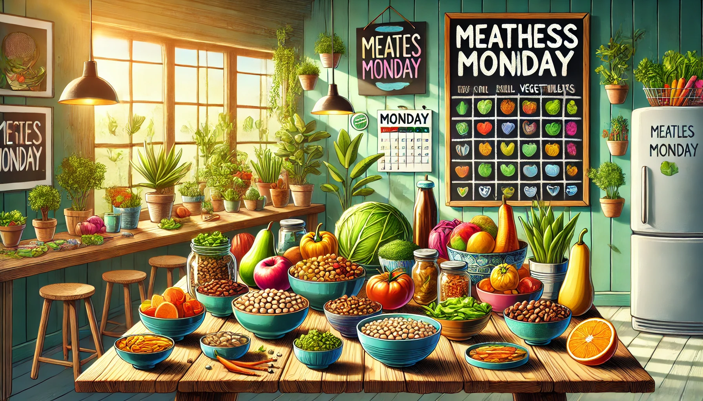

# 5. Consuma meno carne e cibi ad alto impatto ambientale 🍽️

La produzione di carne è una delle principali cause di inquinamento ambientale. Contribuisce in modo significativo alle emissioni di gas serra, alla deforestazione e all'inquinamento delle acque. Ridurre il consumo di carne e di cibi ad alto impatto è un passo importante per preservare il nostro pianeta. 🌍

Ecco alcuni suggerimenti per iniziare:

- **Sostituisci la carne con alternative vegetali**: prova legumi, tofu, tempeh, seitan e piatti a base di cereali, che hanno un impatto ambientale inferiore.
- **Prova una giornata senza carne alla settimana**: impegnati a ridurre il consumo di carne, ad esempio con un "lunedì senza carne".
- **Mangia più frutta e verdura**: scegli prodotti freschi, locali e stagionali per ridurre l’impronta ecologica.
- **Acquista cibi biologici e a km zero**: supporta l’agricoltura sostenibile e riduci il trasporto di cibi a lunga distanza.
- **Riduci i cibi industriali e confezionati**: scegli alimenti freschi e non lavorati, che hanno un minore impatto sulla natura.

Ogni volta che riduci il consumo di carne e scegli cibi a basso impatto, contribuisci a ridurre le emissioni di CO2 e proteggere gli ecosistemi naturali. 🌱

Ricorda: fare scelte alimentari più consapevoli è un piccolo cambiamento che può fare una grande differenza per il futuro del nostro pianeta!

