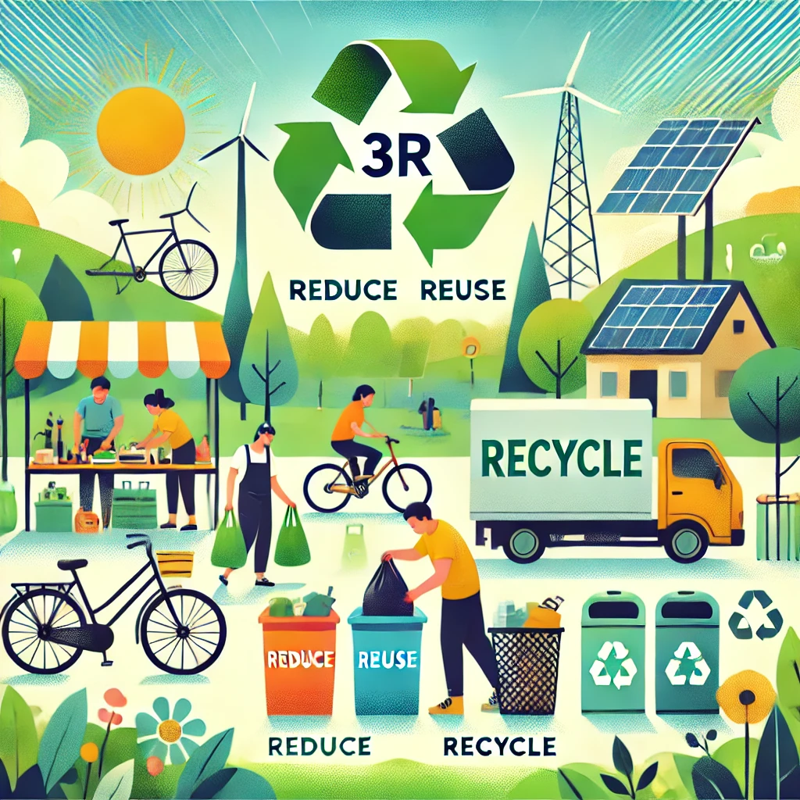

# 6. Riduci, riutilizza e ricicla ♻️

La regola delle 3R è una delle pratiche più efficaci per ridurre il nostro impatto ambientale. Si tratta di tre azioni fondamentali: **ridurre**, **riutilizzare** e **riciclare**. Applicando queste semplici abitudini nella vita quotidiana, possiamo contribuire a ridurre il consumo di risorse, abbattere la produzione di rifiuti e favorire la sostenibilità del nostro pianeta. 🌍

## 1. **Riduci il consumo inutile**
   - Acquista solo ciò che ti serve: cerca di evitare gli acquisti impulsivi e scegli prodotti di qualità che durano di più.
   - Prediligi prodotti con imballaggi ridotti o in materiali riciclabili.
   - Usa l’energia in modo efficiente: spegni luci e dispositivi elettronici quando non li usi e prediligi elettrodomestici a basso consumo.

## 2. **Riutilizza ciò che puoi**
   - Rendi più lunga la vita degli oggetti: usa contenitori riutilizzabili per alimenti, vestiti e oggetti di seconda mano, piuttosto che comprarne di nuovi.
   - Ripara piuttosto che sostituire: invece di buttare un oggetto rotto, prova a ripararlo o a trasformarlo in qualcosa di nuovo.
   - Riutilizza borse e sacchetti: porta sempre con te una borsa riutilizzabile per la spesa e riutilizza gli imballaggi ogni volta che è possibile.

## 3. **Ricicla correttamente ciò che non puoi riutilizzare**
   - Informati sulle regole di riciclo della tua città: ogni località ha norme diverse, quindi è importante sapere cosa può essere riciclato e come.
   - Separa correttamente i materiali: separa plastica, carta, vetro e metallo per facilitare il processo di riciclo.
   - Pensa a come smaltire correttamente le batterie, i prodotti elettronici o gli altri rifiuti speciali che richiedono un trattamento particolare.

Ricordati che ogni piccola azione conta: più riutilizzi e ricicli, meno rifiuti finiscono nelle discariche e più risorse vengono risparmiate per il futuro. 🌱

Fare attenzione al modo in cui gestiamo i nostri rifiuti è fondamentale per costruire un mondo più sostenibile. Ogni volta che riduci, riutilizzi e ricicli, contribuisci a proteggere il nostro pianeta per le future generazioni!

[Scopri altro](https://www.epa.gov/).
