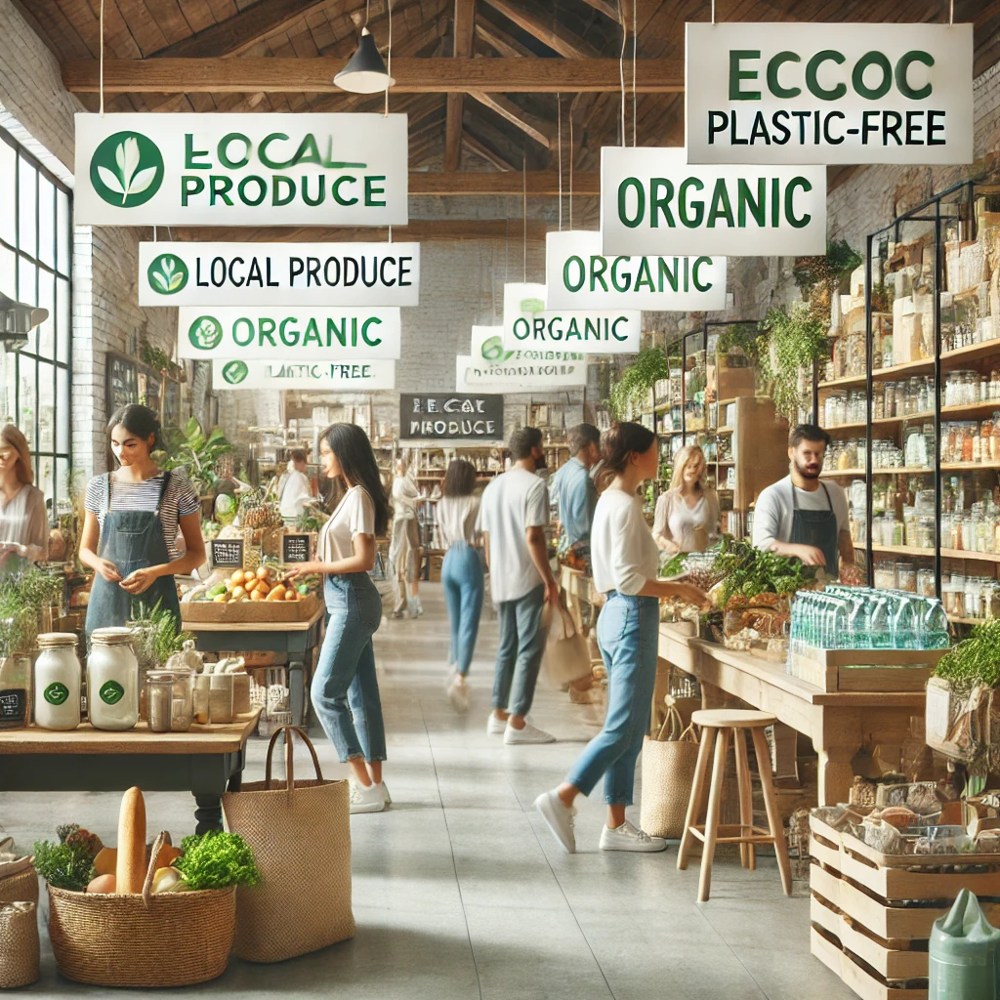

# 7. Acquista responsabilmente 🛒

L'acquisto responsabile è una delle azioni più potenti che possiamo fare per ridurre il nostro impatto sull'ambiente. Ogni volta che acquistiamo qualcosa, votiamo con il nostro portafoglio. Le nostre scelte di consumo influenzano l'intero ciclo di vita dei prodotti, dalla produzione alla distribuzione, fino allo smaltimento. Acquistare in modo consapevole ci permette di ridurre sprechi, risorse non rinnovabili e inquinamento.

### Come acquistare responsabilmente:

- **Scegli prodotti eco-sostenibili**: Opta per prodotti che utilizzano materiali riciclati o biodegradabili. Cerca articoli che possano essere facilmente riciclati o che abbiano una lunga durata, riducendo così la necessità di sostituirli frequentemente. Inoltre, supporta le aziende che adottano politiche di sostenibilità e riducono la loro impronta ecologica.

- **Verifica le certificazioni ambientali**: Prima di acquistare, controlla le etichette e le certificazioni, come FSC (Forest Stewardship Council) per la carta e il legno, o GOTS (Global Organic Textile Standard) per i prodotti tessili biologici. Queste certificazioni garantiscono che i prodotti sono stati realizzati rispettando standard ecologici e sociali elevati.

- **Acquista prodotti locali e stagionali**: Acquistare cibi e altri prodotti locali e stagionali aiuta a ridurre le emissioni di gas serra legate al trasporto. Inoltre, supportare i produttori locali promuove l’economia circolare e la sostenibilità delle risorse locali.

- **Riduci il consumo di plastica**: Scegli prodotti con imballaggi ridotti o biodegradabili per evitare di accumulare plastica monouso. Opta per prodotti senza imballaggi o con confezioni che possano essere facilmente riciclate. Acquistare in grandi quantità o sfuso è un altro modo per ridurre l’impatto delle confezioni.

- **Prima di acquistare, chiediti se ne hai davvero bisogno**: Adottare un approccio più consapevole al consumo significa chiedersi se ciò che stai per acquistare è veramente necessario. Pensa alla durabilità del prodotto, al suo impatto sull’ambiente e se può essere sostituito da qualcosa che già possiedi.

- **Supporta aziende etiche**: Preferisci le aziende che adottano pratiche di lavoro etiche e che si impegnano a ridurre il loro impatto ambientale. Cerca marchi che adottano politiche di trasparenza riguardo alla provenienza dei materiali e alle condizioni di lavoro nelle loro filiere.

- **Investi in qualità, non in quantità**: Spesso siamo tentati di comprare prodotti economici, ma questi tendono a durare meno e a generare più rifiuti. Investire in prodotti di qualità e durevoli è una scelta più vantaggiosa per l’ambiente, oltre che per il tuo portafoglio nel lungo periodo.

- **Acquista prodotti ricondizionati o di seconda mano**: Un altro modo per ridurre l’impatto ambientale è acquistare prodotti ricondizionati o di seconda mano. Questo allunga la vita dei prodotti e riduce la domanda di nuovi articoli, diminuendo la produzione e il consumo di risorse.

- **Opta per soluzioni a basso impatto**: Se possibile, scegli prodotti e servizi a basso impatto ambientale, come i trasporti pubblici, le biciclette, e soluzioni energetiche rinnovabili. Investire in questi prodotti può ridurre significativamente la tua impronta ecologica.

Acquistare responsabilmente non significa solo fare scelte che fanno bene all'ambiente, ma anche promuovere una cultura del consumo più consapevole e responsabile. Ogni nostra scelta di acquisto ha un impatto sul mondo che ci circonda. Con piccoli cambiamenti nelle nostre abitudini di consumo, possiamo contribuire a un futuro più sostenibile per tutti. 🌍

[Scopri altro](https://www.sustainablebrands.com/).
