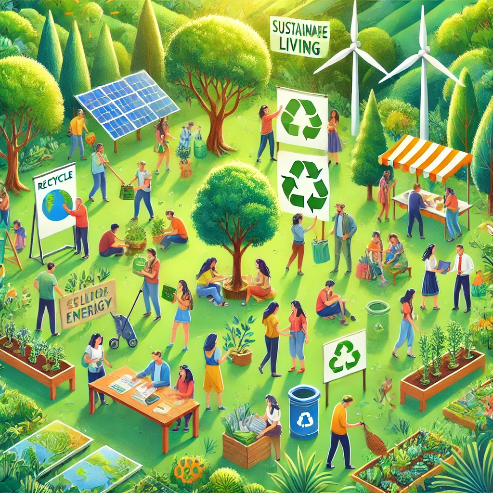

# 9. Educa gli altri sull'importanza dell'ecologia 📚

Il cambiamento positivo inizia spesso con l'educazione. Condividere ciò che impari sull'ambiente può ispirare azioni concrete e creare una rete di persone più consapevoli e responsabili. Ogni informazione trasmessa può avere un grande impatto, stimolando una maggiore attenzione verso l'ambiente. 🌱

### Come educare gli altri:

- **Condividi le tue conoscenze**: Parla di problemi ambientali e soluzioni pratiche, come ridurre i rifiuti, risparmiare energia e mangiare in modo più sostenibile. Ogni discussione aiuta a costruire consapevolezza collettiva.
  
- **Organizza incontri informali**: Organizza piccoli eventi con amici e familiari per parlare di ecologia, cambiamenti climatici o stili di vita sostenibili. Condividi risorse utili come libri, documentari e podcast.

- **Partecipa a eventi e campagne di sensibilizzazione**: Partecipa a manifestazioni, piantumazioni di alberi o pulizie di spiagge. Questi eventi sono anche occasioni per incontrare altre persone appassionate di ecologia.

- **Usa i social media per sensibilizzare**: Condividi contenuti educativi come articoli, storie e soluzioni ecologiche sui social media. La tua voce online può raggiungere molte persone e stimolare il cambiamento.

- **Incoraggia comportamenti eco-friendly**: Promuovi azioni quotidiane come ridurre l’uso della plastica, scegliere cibi stagionali, e ridurre i consumi energetici. Suggerisci alternative sostenibili facilmente integrabili nelle abitudini quotidiane.

- **Sii un esempio vivente**: Le persone sono più propense a seguire l'esempio di chi agisce concretamente. Mostra scelte ecologiche come ridurre il consumo di carne, praticare il riciclo e utilizzare mezzi di trasporto ecologici.

- **Supporta iniziative educative locali**: Partecipa a programmi e workshop educativi offerti da scuole, università o organizzazioni locali per diffondere conoscenza sull’ambiente.

Educare gli altri sull'ecologia è fondamentale per creare una società più informata e ispirare un cambiamento positivo che si propaga attraverso le comunità. Ogni volta che influenzi qualcuno a fare scelte ecologiche, stai contribuendo a costruire un futuro migliore. Insieme possiamo fare la differenza! 🌍

[Scopri altro](https://www.earthday.org/)
