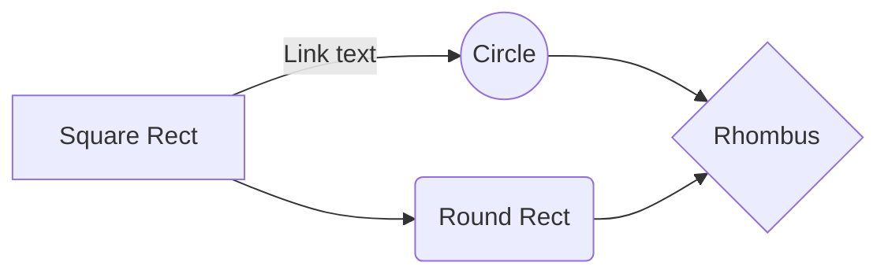
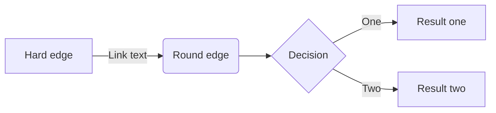

{width=100px height=100px}

# Supportiamo! Un WebBook per promuovere la sostenibilità ambientale.
[Link alla repository del progetto](https://github.com/DavideMasserdotti/Supportiamoci)

## Introduzione
Questo progetto nasce dalla volontà di un ente no-profit di creare un prodotto editoriale di facile lettura, pensato per un pubblico giovanile (18-25 anni) e destinato alla distribuzione tramite social network. 

L'obiettivo principale è sensibilizzare i lettori su temi legati alla sostenibilità ambientale e al cambiamento climatico, fornendo una guida pratica in 12 step per migliorare le proprie abitudini quotidiane.

L'ente ha richiesto un prodotto facilmente aggiornabile per includere nuove scoperte o iniziative e adatto alla distribuzione online. Il progetto sfrutta tecnologie consolidate e innovative: i contenuti sono redatti in Markdown, un formato accessibile e versatile, e vengono poi trasformati in un WebBook utilizzando GitBook. 

GitBook è stato scelto per la sua capacità di sincronizzarsi con repository GitHub e generare un WebBook visivamente accattivante. La personalizzazione dello stile è stata gestita tramite il pannello di controllo di GitBook, permettendo di scegliere colori, font e layout per il WebBook.

I contenuti sono stati generati con il supporto dell'intelligenza artificiale: testi creati con il modello GPT-4 e immagini generate con DALL-E 3. Il risultato finale soddisfa le richieste dell'ente grazie alla sua flessibilità e alla facilità di distribuzione. Inoltre, è stata creata una pagina Instagram per mostrare l'uso pratico del prodotto e per raggiungere il pubblico target in modo efficace.

## Ideazione

### Tema
Il tema richiesto dall'ente riguarda il cambiamento climatico e la sostenibilità ambientale.

Il cambiamento climatico rappresenta una delle sfide più grandi per il nostro pianeta. Negli ultimi anni, l'aumento delle temperature globali, il deterioramento degli ecosistemi e l'incremento di eventi climatici estremi come uragani, incendi e inondazioni hanno evidenziato l'urgenza del problema. 

Il messaggio del WebBook è chiaro: non dobbiamo aspettare interventi da parte di governi o grandi aziende, ognuno può contribuire ogni giorno al miglioramento del pianeta. Per questo, il WebBook propone 12 step pratici e accessibili per adottare uno stile di vita più sostenibile.

### Destinatari
Descrivere i destinatari del prodotto editoriale utilizzando la tecnica delle personas. Descrivere alcuni scenari d'uso nei quali inserire le personas scelte come destinatari.

### Modello di fruizione
L'ente ha richiesto che il prodotto editoriale digitale venga distribuito tramite i social network. Tuttavia, dato che i social sono orientati prevalentemente a contenuti visuali o brevi, si è optato per la creazione di un WebBook. Questo formato è accessibile tramite un browser e distribuito attraverso un semplice link web, facilmente inseribile nei post dei social network.

Il WebBook si adatta automaticamente a qualsiasi dispositivo, garantendo un'esperienza utente uniforme grazie alle tecnologie web consolidate. La scelta di non utilizzare formati come PDF o EPUB è motivata dalla loro minore flessibilità e dalla necessità, in alcuni casi, di software aggiuntivi per la visualizzazione.

Un WebBook rappresenta una soluzione ottimale per un target giovane e dinamico, offrendo facilità di accesso e una fruizione rapida. Inoltre, è stato utilizzato il supporto dell'intelligenza artificiale (GPT-4 per i testi e DALL-E 3 per le immagini) per ottimizzare tempi e qualità di produzione. Per un caso d'uso pratico, è stata creata una pagina Instagram per dimostrare l'efficacia del prodotto.

### Canali di distribuzione
I principali canali di distribuzione scelti sono:

- **WebBook tramite GitBook**: un prodotto digitale consultabile tramite browser. Generato a partire da file Markdown su un repository GitHub, offre flessibilità e facilità di aggiornamento.
- **Post su Instagram**: un'immagine creata per pubblicizzare il WebBook e reindirizzare gli utenti al link di consultazione.

L'identità visiva è stata progettata con colori e immagini coerenti con il tema della sostenibilità ambientale, privilegiando tonalità di verde. Lo stile tipografico e il layout del WebBook sono stati personalizzati tramite il pannello di controllo di GitBook, mantenendo un design giovane e accattivante.

La scelta di questi strumenti riflette la necessità di raggiungere un target fuggevole e abituato a contenuti digitali, rendendo il prodotto fruibile senza barriere tecnologiche.

## Processo di Produzione

### Acquisizione dei contenuti
Descrivere le fonti che saranno utilizzate nella costruzione del prodotto editoriale. Nella scelta delle fonti valutare il costo di acquisizione: (i) disponibili come fonti libere, (ii) generabili automaticamente, (iii) richiedono un lavoro di redazione manuale.

### Gestione documentale

Descrivere il *flusso di gestione documentale* definito per il progetto. Ad esempio, (i) la raccolta o produzione dei contenuti, (ii) la valutazione dei diritti, (iii) la trasformazione dei formati, (iv) la strutturazione dei contenuti, (v) l'applicazione dello stile grafico, (vi) la generazione dei metadati, (vii) la distribuzione dei contenuti. Nella descrizione del flusso considerare le fasi di revisione, controllo e approvazione che possono richiedere le diverse fasi.

### Tecnologie adottate

Descrivere le tecnologie adottate nelle diverse fasi e discuterne il contributo in termini di raggiungimento degli obiettivi descritti negli scenari d'uso.

| Tecnologia     | Scenario 1                | Scenario 2                |
|----------------|---------------------------|---------------------------|
| Markdown       | `'Isn't this fun?'`       | `'Isn't this fun?'`       |
| XSLT           | `"Isn't this fun?"`      | `"Isn't this fun?"`      |
| ePub           | `-- is en-dash, --- is em-dash` | `-- is en-dash, --- is em-dash` |

### Esecuzione del flusso
Allegare, possibilmente attraverso il riferimento a un repository documentale, i materiali, gli script, le configurazioni, che permettono di riprodurre il flusso di produzione documentale. I contenuti non devono necessariamente essere completi, può essere sufficiente fornire un prototipo per ogni tipologia di contenuto previsto e per ogni formato di destinazione previsto.  

## Valutazione dei risultati raggiunti

### Valutazione del flusso di produzione

Per valutare il contributo proposto, analizzare le diverse fasi del flusso in termini di: 
(i) riduzione dei tempi di gestione documentale, 
(ii) riduzione degli errori, 
(iii) miglioramento della qualità dei documenti, 
(iv) miglioramento del livello di accettazione della tecnologia, 
(v) raggiungimento di nuovi canali di distribuzione, 
(vi) soddisfacimento di nuovi scenari d'uso.
 
### Confronto con lo stato dell'arte

Può anche essere utile confrontare una versione ASIS del flusso di gestione, senza la tecnologia o le innovazioni proposte, e una TOBE che include la tecnologia e le innovazioni proposte dallo studente.

### Limiti emersi

È importante sottolineare i limiti emersi. Ad esempio:
- Impossibilità di accesso ad alcune tecnologie o fasi del flusso di gestione documentale
- Limiti nell'automazione di alcune fasi di trasformazione dei formati
- Difficoltà nell'integrazione di sorgenti diverse

## Conclusioni

Discutere i risultati ottenuti, verificando se gli obiettivi definiti dai casi d'uso siano pienamente o parzialmente raggiunti. Evidenziare gli aspetti nei quali si sono raggiunti i risultati più soddisfacenti e le limitazioni emerse.

## Bibliografia e sitografia

Elencare i riferimenti bibliografici e risorse online che hanno maggiormente contribuito alla realizzazione del progetto. Ad esempio [@sechi2010,@pantieri2021,@ceravolo2023].
