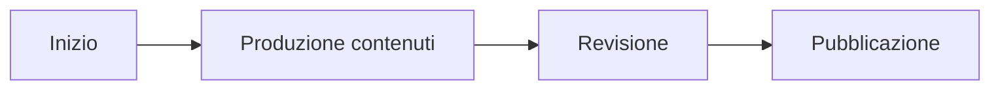

{width=100px height=100px}

# Supportiamo! Un WebBook per promuovere la sostenibilità ambientale

[Link alla repository del progetto](https://github.com/DavideMasserdotti/Supportiamoci)

## Introduzione
Questo progetto nasce dalla volontà di un ente no profit di creare un prodotto editoriale di facile lettura, pensato per un pubblico giovane (18-25 anni) e distribuito tramite social network. L'obiettivo è affrontare temi legati alla sostenibilità ambientale e al cambiamento climatico, offrendo al lettore 12 step pratici per migliorare le proprie abitudini quotidiane.

L'ente richiede che il prodotto sia facilmente modificabile, in modo da integrare nuove scoperte o iniziative, e che sia semplice da distribuire attraverso le piattaforme social. Per raggiungere questo scopo sono state adottate diverse tecnologie. Lo spazio di lavoro è una directory locale collegata a un repository GitHub per gestire il versioning permettendo una facile modificabilità e aggiornabilità. I documenti iniziali sono redatti in Markdown, un formato consolidato, facile da usare e compatibile con molteplici tecnologie. Per il prodotto finale è stato scelto GitBook, una piattaforma che genera un WebBook direttamente dai file Markdown presenti nel repository GitHub. Lo stile del WebBook è stato personalizzato tramite il pannello di controllo di GitBook, che consente di gestire colori, font, layout e altri aspetti grafici.

Per l'acquisizione dei contenuti sono state utilizzate intelligenze artificiali: GPT-4 per i testi e DALL-E 3 per le immagini, con integrazioni manuali ove necessario. Il risultato finale risponde pienamente alle richieste dell'ente grazie alla sua facile modifica, espandibilità e distribuzione sui social network. Per simulare un caso d'uso realistico è stata creata una pagina Instagram dedicata alla promozione del prodotto.

## Ideazione

### Tema
Il tema richiesto dall'ente riguarda il cambiamento climatico e la sostenibilità ambientale.

Il cambiamento climatico rappresenta una delle sfide più grandi per il nostro pianeta. Negli ultimi anni, le temperature globali sono aumentate, gli ecosistemi sono a rischio e gli eventi climatici estremi come uragani, incendi e inondazioni sono diventati sempre più frequenti. 

Non è necessario attendere azioni da governi o grandi aziende per contribuire al cambiamento. Anche il lettore, ogni giorno, può fare la differenza. Il WebBook propone una guida pratica e accessibile, composta da 12 step, per aiutare i lettori a vivere in modo più sostenibile.

### Destinatari

1. **Giulia, 22 anni, studentessa universitaria**
   - **Background**: Frequenta il terzo anno di Scienze Ambientali. È appassionata di ecologia e partecipa spesso a manifestazioni per il clima.
   - **Obiettivi**: Migliorare il suo stile di vita sostenibile e influenzare positivamente amici e follower sui social.
   - **Bisogni**: Informazioni chiare, pratiche e facilmente condivisibili.
   - **Scenario d'uso**: Scopre il WebBook tramite un post su Instagram e lo utilizza per integrare nuove abitudini sostenibili nella sua quotidianità. Condivide il link con i compagni di corso.

2. **Marco, 25 anni, giovane lavoratore**
   - **Background**: Lavora in una startup tecnologica e trascorre molto tempo sui social media. È interessato a temi ambientali, ma ha poco tempo per approfondirli.
   - **Obiettivi**: Trovare soluzioni rapide e pratiche per ridurre il proprio impatto ambientale.
   - **Bisogni**: Contenuti sintetici e visivamente accattivanti.
   - **Scenario d'uso**: Vede un post sponsorizzato sul WebBook durante una pausa pranzo. Applica alcuni suggerimenti e condivide il link con i colleghi su WhatsApp.

3. **Sara, 19 anni, influencer emergente**
   - **Background**: Gestisce un profilo Instagram dedicato alla moda sostenibile. Cerca sempre nuovi argomenti per coinvolgere i follower.
   - **Obiettivi**: Creare contenuti di valore che aumentino l'engagement del pubblico.
   - **Bisogni**: Materiale interessante e visivamente accattivante per post e storie.
   - **Scenario d'uso**: Usa il WebBook come ispirazione per un post sul cambiamento climatico. Promuove il link nelle sue storie e riceve feedback positivo dai follower.

4. **Luca, 23 anni, gamer appassionato**
   - **Background**: Appassionato di tecnologia e giochi online. Non è particolarmente attento ai temi ambientali, ma è curioso e aperto a nuove idee.
   - **Obiettivi**: Scoprire modi semplici per contribuire alla sostenibilità senza cambiare radicalmente il proprio stile di vita.
   - **Bisogni**: Contenuti divertenti e immediati.
   - **Scenario d'uso**: Clicca su un link al WebBook condiviso da un amico su Discord. Applica uno degli step suggeriti e condivide il link con la sua community.

### Modello di fruizione
L'ente richiede un prodotto editoriale digitale distribuito tramite social. Poiché i social network favoriscono contenuti immediati come foto e video, è stato scelto di creare un WebBook, un prodotto digitale consultabile tramite browser e facilmente condivisibile attraverso un link. 

Questa soluzione garantisce fruibilità su una vasta gamma di dispositivi e offre una maggiore adattabilità rispetto a formati come PDF o ePub, che possono richiedere software aggiuntivi o non adattarsi perfettamente ai dispositivi mobili. 

Il WebBook funge da ponte tra il mondo social, spesso troppo rapido per approfondire i contenuti, e il mondo editoriale tradizionale, meno accessibile ai giovani. La scelta di tecnologie innovative come GPT-4 e DALL-E 3 ha reso la creazione di contenuti rapida e di alta qualità. Per mostrare un esempio concreto, è stata creata una pagina Instagram dedicata alla promozione del WebBook.

### Canali di distribuzione
I canali di distribuzione scelti sono i social media. I formati selezionati sono:

- **WebBook tramite GitBook**: Un prodotto web generato da file Markdown presenti su un repository GitHub, fruibile tramite browser.
- **Post su Instagram**: Immagini visivamente accattivanti per promuovere il prodotto e reindirizzare gli utenti al WebBook tramite un link.

L'identità visiva è stata curata utilizzando DALL-E per generare immagini e loghi coerenti con il tema della sostenibilità. Lo stile grafico, tipografico e di layout è stato definito tramite la dashboard di GitBook, privilegiando tonalità di verde per richiamare il tema ambientale.

In questo settore non esistono classi di documento standard de iure, ma de facto, poiché i social sono fortemente legati a Internet e al mondo Web, l'uso di tecnologie di questo tipo facilita la fruizione e la distribuzione dei contenuti.

Creare prodotti innovativi è essenziale per distinguersi dalla massa, ma nel caso dei social network, la velocità di fruizione è fondamentale. Sarebbe sconsigliato utilizzare tecnologie che richiedano applicazioni di terze parti per accedere ai contenuti o che non siano completamente compatibili con i dispositivi mobili. Il lettore di riferimento, in questo caso, è fugace: è necessario un prodotto che possa essere facilmente consumato tramite le tecnologie che il pubblico è abituato a usare nella vita quotidiana.

Proprio per questo motivo, e considerando il target di riferimento, ovvero ragazzi dai 18 ai 25 anni, il prodotto sarà informale. La stesura del contenuto si adatterà alle caratteristiche di questo pubblico, risultando giovane ma comunque professionale e utile.
## Processo di Produzione

### Acquisizione dei contenuti
L'acquisizione dei contenuti è avvenuta attraverso un approccio misto. 

La fase iniziale di generazione del testo è stata realizzata tramite intelligenza artificiale utilizzando **ChatGPT basato sul modello GPT-4**. Questo modello di linguaggio avanzato, sviluppato da OpenAI, è stato progettato per comprendere e produrre testo in modo coerente e pertinente. Successivamente, è stata effettuata una fase di revisione manuale del contenuto per garantire una qualità elevata, integrare eventuali informazioni mancanti e verificare l'accuratezza delle fonti utilizzate. Qualora le fonti originali si fossero rivelate insufficienti, ne sono state selezionate ulteriori per completare il processo di acquisizione dei contenuti in maniera rigorosa.

Per quanto riguarda gli elementi visivi, tutte le immagini incluse sono state generate tramite **intelligenza artificiale utilizzando il modello DALL-E 3**, anch’esso sviluppato da OpenAI. Questo modello è stato scelto per la sua capacità di creare immagini realistiche o stilizzate basandosi su descrizioni testuali dettagliate. La progettazione delle immagini ha tenuto conto sia del tipo di prodotto digitale che dello stile grafico di riferimento, assicurando coerenza e attrattiva visiva.

Infine, per arricchire ulteriormente l’esperienza dell’utente, è stato incluso un video introduttivo di YouTube realizzato da **National Geographic**, il quale introduce i temi principali trattati nel webbook. Questo elemento multimediale aggiunge profondità e contesto ai contenuti proposti, migliorando l'interattività del prodotto digitale.

## Spiegazione dei modelli adottati

1. **GPT-4**: Si tratta di un modello di linguaggio di ultima generazione sviluppato da OpenAI, noto per la sua capacità di comprendere il contesto e produrre risposte dettagliate e accurate. È particolarmente adatto per la generazione di testi complessi, supportando attività come la scrittura creativa, la revisione e l’elaborazione di contenuti tecnici.

2. **DALL-E 3**: È un modello di generazione di immagini basato sull’intelligenza artificiale, che utilizza descrizioni testuali per creare immagini di alta qualità. Rispetto ai suoi predecessori, DALL-E 3 offre una maggiore precisione nella rappresentazione visiva e una comprensione più avanzata delle istruzioni fornite, rendendolo uno strumento ideale per progetti digitali in cui è richiesta coerenza grafica e creatività.

---

Questo approccio combinato ha permesso di realizzare un prodotto digitale innovativo, integrando contenuti testuali e visivi di alta qualità per offrire agli utenti un’esperienza completa e immersiva.

### Gestione documentale
Il flusso di gestione documentale si compone delle seguenti fasi:

1. Raccolta e produzione dei contenuti.
2. Valutazione dei diritti.
3. Trasformazione dei formati.
4. Strutturazione dei contenuti.
5. Applicazione dello stile grafico.
6. Generazione dei metadati.
7. Distribuzione dei contenuti.

Le fasi di revisione, controllo e approvazione sono integrate per garantire qualità e coerenza.

### Tecnologie adottate

Le tecnologie utilizzate sono state scelte per garantire l'efficacia delle diverse fasi del progetto e includono:

| Tecnologia | Contributo principale |
|------------|------------------------|
| Markdown   | Strutturazione testi   |
| GitBook    | Generazione WebBook    |
| GPT-4      | Creazione contenuti    |
| DALL-E 3   | Creazione immagini     |

### Esecuzione del flusso
Tutti i materiali, script e configurazioni necessari per riprodurre il flusso di produzione documentale sono disponibili nel repository GitHub associato al progetto. Sono stati creati prototipi per ogni tipologia di contenuto e formato previsto.

## Valutazione dei risultati raggiunti

### Valutazione del flusso di produzione
Il flusso proposto ha permesso di:

1. Ridurre i tempi di gestione documentale.
2. Minimizzare gli errori.
3. Migliorare la qualità complessiva dei documenti.
4. Favorire l'accettazione della tecnologia da parte degli utenti.
5. Aprire nuovi canali di distribuzione.

### Confronto con lo stato dell'arte
Il confronto tra una versione "AS IS" (senza innovazioni) e una "TO BE" (con le innovazioni proposte) evidenzia miglioramenti significativi in termini di efficienza e qualità.

### Limiti emersi
Tra i limiti principali:

- Impossibilità di accedere ad alcune tecnologie avanzate.
- Automazione non completa di alcuni passaggi del flusso.
- Limitazioni nell'integrazione di alcune fonti.

## Conclusioni
I risultati ottenuti dimostrano che gli obiettivi definiti sono stati pienamente raggiunti. Il progetto ha mostrato punti di forza, come la facilità di distribuzione e la qualità dei contenuti, e ha messo in luce alcune aree di miglioramento, come l'automazione del flusso.

## Bibliografia e sitografia
[@sechi2010, @pantieri2021, @ceravolo2023]
